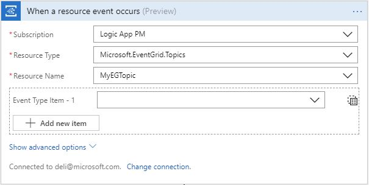
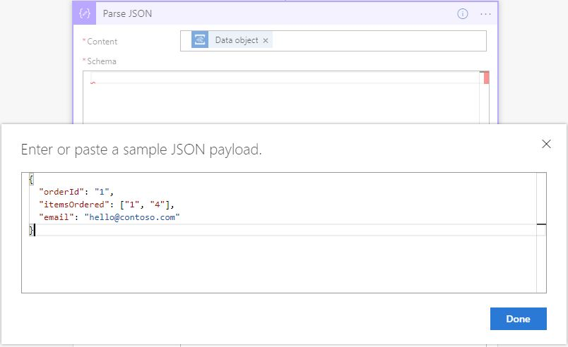
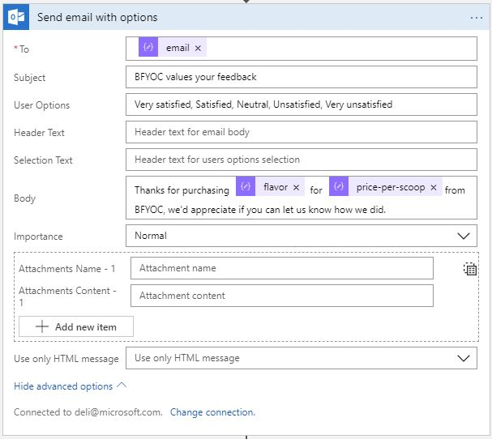
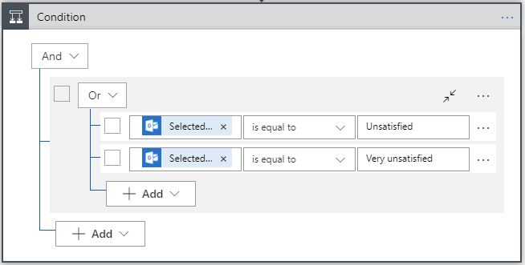

# Module 3 - Logic Apps

As BFYOC, customer satisfaction is of the utmost importance. Because of this, BFYOC has decided to implement a customer survey system to follow up after purchase to collect feedback.

In this module, you will be using Logic Apps as the workflow engine and integration platform to connect all the pieces together and implement such system. Let's get started.

## Pre-requisites

* A modern laptop running Windows 10, Mac OSX Mac OS X 10.12 or higher
* Your preferred browser to access [Azure Portal](https://portal.azure.com)

## Challenge

Create a Logic App that will be triggered by an incoming custom Event Grid topic event. 

```json
{
  "orderId": "1",
  "itemOrdered": "52325",
  "email": "hello@contoso.com"
}
```

Upon receiving the event, the Logic App will query Cosmos DB to retrieve the product information, using the Cosmos Db connector. Once the product information is retrieved, make the Logic App to into sleep for 5 minutes to simulate a delay before the follow up. Then, send an e-mail with different options (`Very satisfied`, `Satisfied`, `Neutral`, `Unsatisfied`, `Very unsatisfied`) so users can response. Then, you will be able to take customer's response and take appropriate actions.

Capture user's respond and store it in another table in Cosmos DB.

### Tips

1. First things first, make sure you get the tools installed listed above.  

### Guided instructions
<!-- markdownlint-disable MD032 MD033 -->
<details><summary>Click to open</summary><p>
  
1. Navigate to [Azure Portal](https://portal.azure.com)
1. Create a new Logic App and navigate to the newly created Logic App
1. Edit on **Edit** to launch Logic Apps designer
1. Select `Event Grid` from the list then select `When a resource event occurs` trigger

1. Sign in with the same account you used to sign into Azure portal
1. Fill in **Subscription**, select `Microsoft.EventGrid.Topics` for **Resource Type**, and select the name you of your custom topic created in **module 3**.
1. Next, add a `Parse JSON` action by clicking **New step** and search for it.
1. Use `Data object` as the input to  **Content**.
1. The easiest way to create the schema is to generate it using a sample, simply click on **Use sample payload to generate schema**, and provide the sample from **module 3**, as shown below.
```json
{
  "orderId": "1",
  "itemOrdered": "52325",
  "email": "hello@contoso.com"
}
```

1. Search for `Cosmos Db` and add `Get a document` action, you will first need to create a connection to it.
1. Select `icecream` as **Database ID**, `products` as **Collection ID**, and select `itemOrdered` token as input to **DocumentId**.
1. Next, add a new action from either Outlook 365 or Outlook.com, depending on the type of account you have. The name of the action is **Send email with options**.
1. Add another `Parse JSON` action, this time, use the `Body` output from `Get a document` action as input to **Content**, and use the following sample to generate schema.
```json
{
  "id": "1",
  "flavor": "Rainbow Road",
  "price-per-scoop": 3.99
}
```
1. Use `email` token as input for **To**, `BFYOC values your feedback` as **Subject**, and `Very satisfied, Satisfied, Neutral, Unsatisfied, Very unsatisfied` for **User Options**. Then, use various tokens available to write a nice e-mail body.

1. Add a `Condition` action, and create a rule for when customer selected either **Unsatisfied** or **Very unsatisfied**.


### What's Next?
It's up to you what action to take when there's an unhappy customer! Send them a email with coupon code, inform a team member to follow up, you decided. Explore more than [200 different products and services](https://docs.microsoft.com/connectors/) Logic Apps connects to out-of-box and build something awesome.
 
</p></details>
<!-- markdownlint-disable MD032 MD033 -->

## Documentation

* [Quickstart: Create your first automated workflow with Azure Logic Apps - Azure portal](https://docs.microsoft.com/azure/logic-apps/quickstart-create-first-logic-app-workflow)
* [Manage mailing list requests with a logic app](https://docs.microsoft.com/azure/logic-apps/tutorial-process-mailing-list-subscriptions-workflow)
* [Get started with the delay and delay-until actions](https://docs.microsoft.com/azure/connectors/connectors-native-delay)